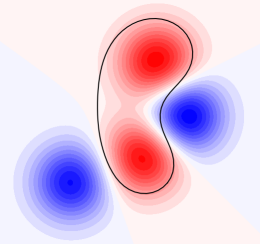

# PyCheeger
Numerical computation of (weighted) Cheeger sets (under active development).

  

Acknowledgments: we thank Robert Tovey for carefuly reviewing this implementation, and for suggesting several modifications that significantly improved its performance.

[Documentation](https://rpetit.github.io/PyCheeger)
